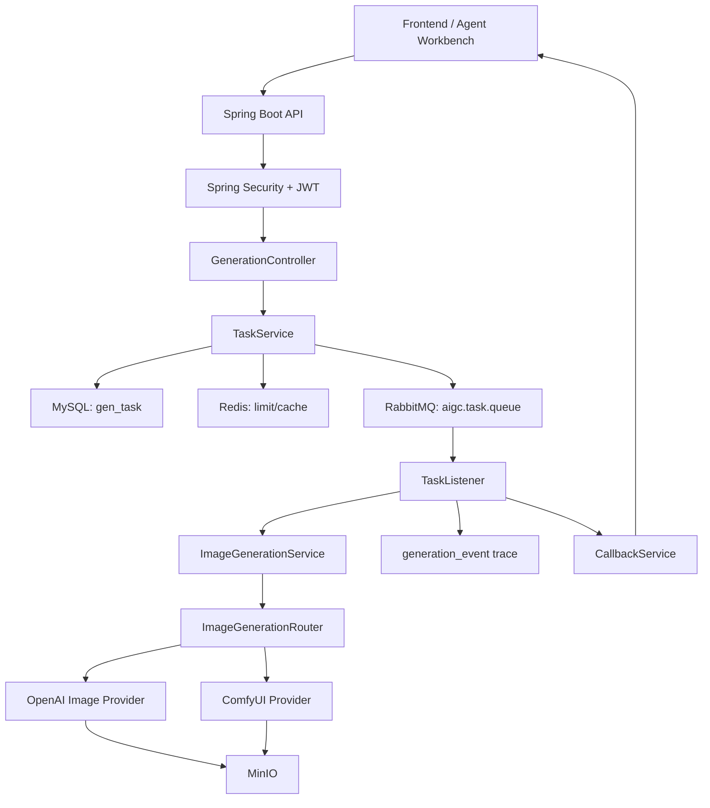
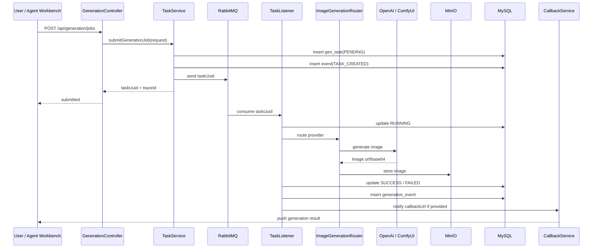

# AIGC-GameFlow Engine

面向游戏 AI 工作流的多平台图像生成执行引擎。

这个项目不是一个简单的“文生图 Demo”，而是一个用于承接上游 Agent 工作流的后端执行服务。它负责接收游戏策划、角色设定、素材生成 Prompt 等请求，通过 RabbitMQ 异步执行生图任务，并将结果统一存储到 MinIO，同时提供任务查询、事件追踪、失败回调、重试与取消能力。

项目可以单独作为 AIGC 后端服务运行，也可以作为 `GameDev Agent Workbench` 的下游生成引擎使用。

## 项目定位

- 面向场景：小游戏素材生成、角色设定图生成、AI 工具流后端、Agent 工作流下游执行
- 面向岗位：Java 后端开发、AI 应用开发、AIGC 工具链开发、Agent 应用开发
- 核心目标：把 `用户鉴权 -> 任务提交 -> 消息队列 -> 多平台生图 -> 对象存储 -> 状态追踪 -> 上游回调` 串成可落地的后端链路

## 核心功能

- 用户注册、登录与 JWT 鉴权
- 统一图像生成任务接口：`/api/generation/jobs`
- 支持 OpenAI Image API 与 ComfyUI 两类生图平台
- 支持按策略选择生图 Provider：`AUTO`、`LOCAL_FIRST`、`QUALITY_FIRST`、`COST_FIRST`
- 基于 RabbitMQ 的异步任务消费，避免长耗时生成阻塞 HTTP 请求
- 基于 Redis 的提交限流与任务状态缓存
- 基于 MySQL 的任务状态、用户余额和事件记录持久化
- 基于 MinIO 的图片结果统一存储
- 基于 Neo4j 的游戏角色知识图谱能力
- 基于 LangChain4j 的游戏世界观 Agent 对话能力
- 支持任务事件追踪、失败原因记录、任务重试、任务取消和上游回调
- 支持 Docker Compose 一键启动本地完整环境

## 技术栈

| 分类 | 技术 |
| --- | --- |
| 后端语言 | Java 21 |
| 后端框架 | Spring Boot 3, Spring MVC, Spring Security |
| 数据访问 | MyBatis-Plus |
| 数据库 | MySQL |
| 缓存 | Redis |
| 消息队列 | RabbitMQ |
| 对象存储 | MinIO |
| 图数据库 | Neo4j |
| AI 应用 | LangChain4j, Tool Calling, Prompt Workflow |
| 生图平台 | OpenAI Image API, ComfyUI |
| 部署 | Docker, Docker Compose |

## 系统架构



## 用户请求处理链路

用户或上游 Agent 工作流提交生图任务后，系统不会同步等待图片生成完成，而是立即返回 `taskUuid` 和 `traceId`，后续由 RabbitMQ 消费者异步处理。



## 任务状态与事件追踪

生成任务主状态保存在 `gen_task` 表，关键过程记录在 `generation_event` 表。

常见事件包括：

| 事件 | 含义 |
| --- | --- |
| `TASK_CREATED` | 任务已创建 |
| `TASK_QUEUED` | 任务已投递到 RabbitMQ |
| `TASK_RUNNING` | 消费者开始处理任务 |
| `PROVIDER_SELECTED` | 已选择 OpenAI 或 ComfyUI |
| `PROVIDER_REQUEST_SENT` | 已向生图平台发送请求 |
| `IMAGE_STORED` | 图片已存储到 MinIO |
| `TASK_SUCCESS` | 任务成功 |
| `TASK_FAILED` | 任务失败 |
| `CALLBACK_SENT` | 已回调上游系统 |
| `CALLBACK_FAILED` | 回调上游失败 |
| `TASK_CANCELED` | 任务被取消 |
| `TASK_RETRY_REQUESTED` | 用户请求重试 |

通过 `traceId` 和事件表可以定位任务失败发生在哪一步，例如 Provider 调用失败、MinIO 上传失败或回调失败。

## 目录结构

```text
src/main/java/aigc/gameflow
  config/              # Spring、Redis、RabbitMQ、MinIO、安全配置
  controller/          # REST API
  dto/                 # 请求与响应对象
  image/               # 多平台生图抽象与路由
  mapper/              # MyBatis-Plus Mapper
  model/entity/        # MySQL 实体
  model/graph/         # Neo4j 图节点
  mq/                  # RabbitMQ 消费者
  repository/          # Neo4j Repository
  service/             # 核心业务服务
  utils/               # JWT 等工具
src/main/resources
  static/              # 简单演示页面
  workflows/           # ComfyUI 工作流模板
  application.yml
  application-docker.yml
  schema.sql
```

## 快速启动

### 方式一：Docker Compose 完整启动

适合本地演示或快速部署整套环境。

```powershell
copy .env.template .env
docker compose up -d --build
```

启动后访问：

| 服务 | 地址 |
| --- | --- |
| 后端服务 | `http://localhost:8080` |
| RabbitMQ 管理台 | `http://localhost:15672` |
| MinIO 控制台 | `http://localhost:9001` |
| Neo4j Browser | `http://localhost:7474` |

默认账号：

```text
RabbitMQ: guest / guest
MinIO: minioadmin / minioadmin
Neo4j: neo4j / 12345678
```

### 方式二：开发调试模式

适合日常开发。中间件使用 Docker，Java 服务在 IDEA 中启动。

```powershell
copy .env.template .env
docker compose up -d mysql redis rabbitmq minio neo4j
```

然后在 IDEA 中运行 Spring Boot 主类。

## 环境变量

配置模板见 [.env.template](.env.template)。

核心配置：

```env
MYSQL_HOST=mysql
REDIS_HOST=redis
RABBITMQ_HOST=rabbitmq
MINIO_ENDPOINT=http://minio:9000
NEO4J_URI=bolt://neo4j:7687

DEFAULT_IMAGE_PROVIDER=OPENAI
OPENAI_API_KEY=sk-your-openai-api-key
OPENAI_IMAGE_MODEL=gpt-image-1

COMFYUI_BASE_URL=http://host.docker.internal:8000
DEEPSEEK_API_KEY=sk-your-deepseek-api-key
```

如果使用本机 ComfyUI，推荐让 ComfyUI 运行在宿主机，Java 容器通过下面地址访问：

```env
COMFYUI_BASE_URL=http://host.docker.internal:8000
```

## 主要接口

### 用户接口

| 方法 | 路径 | 说明 |
| --- | --- | --- |
| `POST` | `/user/register` | 用户注册 |
| `POST` | `/user/login` | 用户登录，返回 JWT |

### Agent 接口

| 方法 | 路径 | 说明 |
| --- | --- | --- |
| `POST` | `/agent/chat` | 普通 Agent 对话 |
| `POST` | `/agent/chat/stream` | SSE 流式 Agent 对话 |

### 图像生成接口

| 方法 | 路径 | 说明 |
| --- | --- | --- |
| `POST` | `/api/generation/jobs` | 提交生图任务 |
| `GET` | `/api/generation/jobs` | 查询当前用户任务列表 |
| `GET` | `/api/generation/jobs/{taskUuid}` | 查询任务详情 |
| `GET` | `/api/generation/jobs/{taskUuid}/events` | 查询任务事件链路 |
| `POST` | `/api/generation/jobs/{taskUuid}/retry` | 重试任务 |
| `POST` | `/api/generation/jobs/{taskUuid}/cancel` | 取消任务 |
| `GET` | `/api/generation/providers` | 查询可用 Provider |

### 提交生图任务示例

```http
POST /api/generation/jobs
Authorization: Bearer <jwt-token>
Content-Type: application/json
```

```json
{
  "prompt": "一名赛博朋克风格的小游戏主角，像素风，蓝色外套",
  "negativePrompt": "low quality, blurry",
  "preferredProvider": "OPENAI",
  "model": "gpt-image-1",
  "size": "1024x1024",
  "quality": "auto",
  "sourceApp": "gamedev-agent-workbench",
  "externalRunId": "workflow-run-001",
  "callbackUrl": "http://host.docker.internal:8081/api/callbacks/generation"
}
```

响应示例：

```json
{
  "code": 200,
  "message": "generation job submitted",
  "data": {
    "taskUuid": "7a9d4b2c-xxxx-xxxx-xxxx-6e9f1d2c3b4a",
    "status": "PENDING",
    "provider": "OPENAI",
    "traceId": "3b52d5d1-xxxx-xxxx-xxxx-9d91aa0b2b7d"
  }
}
```

## 与 Agent 工作台的关系

推荐组合展示方式：

```text
GameDev Agent Workbench
  负责：需求拆解、游戏概念生成、核心循环设计、Prompt 生成、Workflow 记录

AIGC-GameFlow Engine
  负责：接收 Prompt、选择生图平台、异步执行任务、存储图片、回调结果
```

两者组合后形成完整链路：

```text
小游戏需求
-> Agent 拆解与 Prompt 生成
-> AIGC-GameFlow Engine 提交生图任务
-> RabbitMQ 异步执行
-> OpenAI / ComfyUI 生图
-> MinIO 存储结果
-> 回调上游 Workflow
-> 用户查看最终素材
```

## 项目文档

- [项目链路图](docs/ARCHITECTURE_FLOW.md)
- [升级方案](docs/PROJECT_UPGRADE_PLAN.md)
- [升级实现说明](docs/PROJECT_UPGRADE_IMPLEMENTATION.md)
- [简历项目描述](docs/RESUME_PROJECT_DESC.md)

## 开发计划

- 接入更多图片生成平台，统一 Provider 能力描述
- 增加任务失败自动重试和死信队列
- 增加 OpenAPI / Apifox 接口文档
- 增加基础单元测试与集成测试
- 增加前端任务看板，展示任务状态和事件时间线
- 与 `GameDev Agent Workbench` 完成更完整的端到端联动演示

