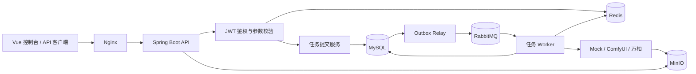
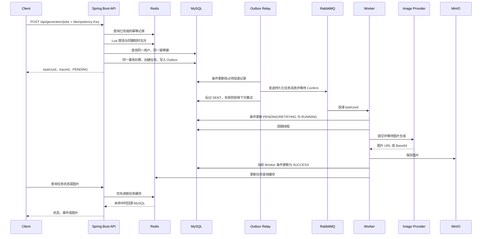
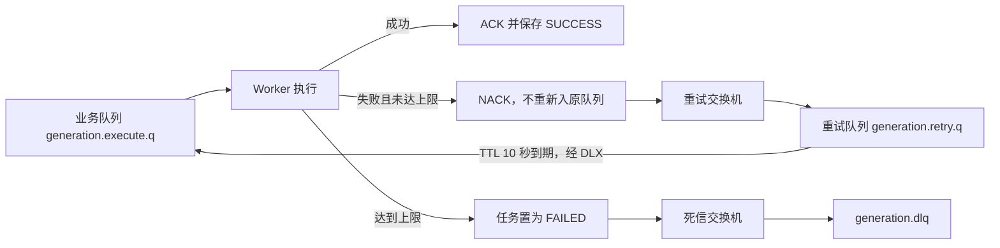
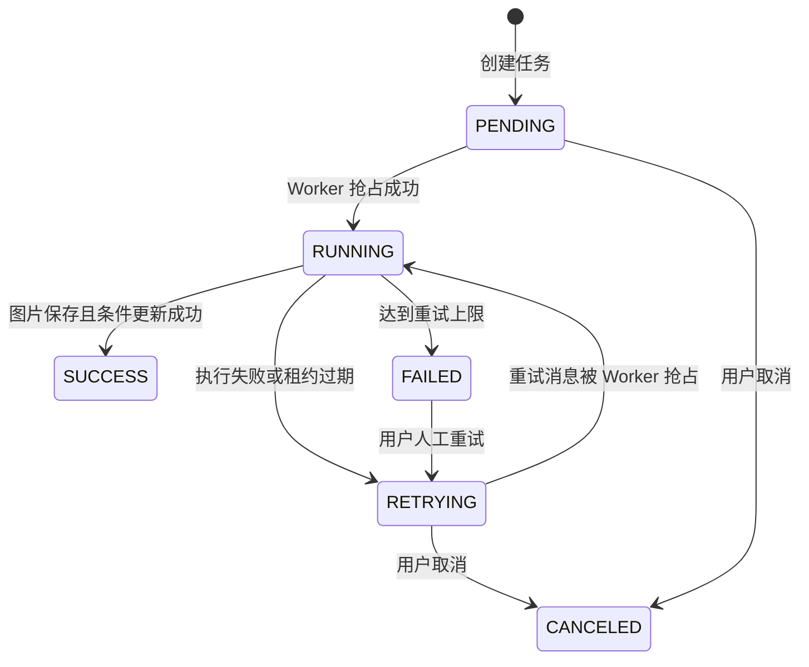

# AIGC-GameFlow

面向耗时且可能失败的图片生成调用，将同步等待拆分为任务提交与异步执行，并通过 MySQL、Redis、RabbitMQ 和 Worker 状态控制处理重复提交、消息投递失败、执行重试与服务中断恢复。

项目包含一个 Vue 3 任务控制台和一个 Java 21 后端。用户提交提示词后立即获得任务编号，后台 Worker 调用 Mock、ComfyUI 或阿里云百炼万相生成图片，将结果统一保存到 MinIO，客户端通过任务接口查询进度和结果。

> 本项目重点展示异步任务系统的工程实现，不提供未经固定环境验证的 QPS、P95 或生产规模数据。Docker Compose 默认使用免费 Mock Provider，不会调用付费生图接口。

## 核心能力

- **防止重复创建和扣费**：客户端为请求提供 `Idempotency-Key`，服务端绑定请求哈希、复用已有任务，并由 MySQL 唯一索引处理并发竞争。
- **避免任务落库后消息丢失**：余额扣减、任务创建和待投递记录在同一 MySQL 事务提交，再由后台 Relay 确认发送到 RabbitMQ。
- **异步执行与失败重试**：HTTP 请求只负责接收任务；Provider 调用由 RabbitMQ Worker 执行，临时失败经过 TTL 重试队列延迟后重新消费，超过上限进入死信队列。
- **并发抢占与中断恢复**：Worker 执行前通过数据库条件更新取得任务所有权，运行期间续租；租约过期后定时任务重新投递，旧 Worker 的迟到结果不能覆盖新状态。
- **入口和查询压力控制**：Redis Lua 限制用户级与全局提交频率，RabbitMQ 积压超限时拒绝新任务；任务详情和批量状态查询优先读取 Redis。
- **统一生图接口与结果存储**：通过 Provider 接口接入 Mock、ComfyUI 和万相，生成结果统一转存 MinIO，避免依赖第三方临时图片地址。

## 系统架构



各组件的实际职责：

| 组件 | 职责 |
| --- | --- |
| MySQL | 保存用户余额、任务状态、执行租约、Outbox 和事件记录，是业务状态的最终事实源 |
| Redis | 幂等结果缓存、同键短时互斥、固定窗口提交限流、任务查询缓存 |
| RabbitMQ | 解耦任务提交与图片生成，承载业务队列、延迟重试队列和死信队列 |
| Worker | 抢占任务、维护执行租约、调用 Provider、保存结果并推进任务状态 |
| MinIO | 保存 Mock、ComfyUI 或万相返回的最终图片 |
| Nginx | 托管前端静态资源，并以 `least_conn` 转发到两个 Spring Boot 实例 |

## 核心执行流程

### 从提交到完成



### 失败重试



配置 `generation.retry.max-attempts` 默认值为 `3`。当前实现允许首次执行以及最多 3 次重试；最终失败后记录错误和任务事件，并把消息发送到 DLQ。

## 核心技术设计

### 1. 请求幂等

**问题**：用户重复点击或客户端在网络超时后重试，可能重复创建任务并重复扣减余额。

**实现流程**：

1. 提交接口要求 `Idempotency-Key` 长度为 8～128 个字符。
2. 服务端对请求体序列化后计算 SHA-256 哈希。
3. Redis 中存在同一用户、同一键的结果时：
   - 请求哈希一致：直接返回原 `taskUuid`；
   - 请求哈希不同：返回 HTTP 409，阻止一个键表示两个不同请求。
4. 未命中时使用 Redis `SET NX` 做 10 秒同键互斥，并再次查询 MySQL。
5. 数据库通过 `(user_id, idempotency_key)` 唯一索引处理最终并发竞争；发生唯一键冲突时读取并返回已经创建的任务。
6. 创建成功后将 `requestHash|taskUuid` 写入 Redis，默认保存 24 小时。

Redis 是减少重复查询和并发竞争的快速路径，MySQL 唯一索引才是最终正确性约束。当前短时互斥没有使用随机锁值和 compare-and-delete，因此不将它描述为完整的分布式锁。

### 2. 原子扣费与本地事务

任务创建前通过一条条件 SQL 扣减余额：

```sql
UPDATE sys_user
SET balance = balance - 1
WHERE id = ? AND balance > 0;
```

只有受影响行数为 1 才继续创建任务，避免先查询余额再更新造成并发超扣。余额扣减、`gen_task` 插入和 `generation_outbox` 插入由同一个 `TransactionTemplate` 管理，任一步骤抛出异常都会回滚该事务。

### 3. 数据库与 RabbitMQ 消息一致性

直接采用“提交数据库后立即发送 MQ”会存在一个时间窗口：数据库已经提交，但应用在发送消息前宕机，任务会永久停留在 `PENDING`。

当前实现先把待发送事件写入 `generation_outbox`：

1. 任务、扣费和 Outbox 在同一数据库事务提交。
2. `OutboxRelayService` 默认每 500 毫秒扫描一批到期记录。
3. 多个 Relay 实例通过条件 `UPDATE` 抢占记录，并写入 `locked_by` 和 `locked_until`。
4. Relay 发送持久化 RabbitMQ 消息，等待 Publisher Confirm，并检查消息是否因路由失败被退回。
5. 确认成功后将记录标记为 `SENT`；失败时清除占用并按指数退避设置下次投递时间。
6. Relay 在处理过程中宕机时，其他实例可以在 `locked_until` 过期后重新抢占。

该链路提供的是**至少一次投递**。如果 RabbitMQ 已确认，但应用在写入 `SENT` 前宕机，消息可能被再次发送，因此消费者仍需依靠任务状态条件更新处理重复消息。

当前 Outbox 没有最大重试次数、失败告警和历史清理任务；RabbitMQ 长时间不可用时记录会持续退避重试。

### 4. RabbitMQ 重试与手动确认

消费者使用手动 ACK：

- 任务成功或发现无法抢占时执行 ACK；
- 临时失败时先把任务状态从 `RUNNING` 条件更新为 `RETRYING`，再 NACK 且不重新进入原队列；
- 原业务队列的死信进入重试交换机和重试队列；
- 重试队列等待 10 秒 TTL 后，经死信配置返回业务交换机；
- 达到上限时任务转为 `FAILED`，消息被发送到 `generation.dlq` 后再 ACK 原消息。

需要注意，`RUNNING → RETRYING` 的数据库更新和 RabbitMQ NACK 不是同一个事务；最终 DLQ 发送目前也没有等待 Publisher Confirm。这些是当前实现仍可继续加固的边界。

### 5. Worker 抢占与故障恢复

多个 Worker 收到相同 `taskUuid` 时，不先查询再决定是否执行，而是通过条件 SQL 抢占：

```sql
UPDATE gen_task
SET status = RUNNING,
    worker_id = ?,
    lease_expire_time = ?,
    last_heartbeat_time = NOW(),
    version = version + 1
WHERE task_uuid = ?
  AND status IN (PENDING, RETRYING);
```

只有更新成功的 Worker 才会调用生图 Provider。任务运行期间默认每 20 秒续租一次，租约有效期默认 60 秒。

如果 Worker 宕机或长时间无法续租：

1. 定时恢复任务默认每 10 秒扫描一次过期的 `RUNNING` 任务。
2. 通过任务状态、原 `worker_id` 和数据库时间再次执行条件更新。
3. 未达到重试上限时转为 `RETRYING`，并在同一事务写入新的 Outbox。
4. 达到重试上限时转为 `FAILED`。
5. 旧 Worker 恢复后，只有任务仍属于自己且租约有效时才能写入成功结果；否则记录迟到结果被忽略。

这里的恢复是**重新执行整个任务**，不是从 Provider 内部断点继续。旧 Worker 已经发出的外部请求不能撤销，因此极端情况下 Provider 仍可能被调用多次，但旧执行结果不会覆盖数据库中的新状态。

### 6. Redis 的实际职责

| 用途 | 实现 |
| --- | --- |
| 幂等结果缓存 | 保存请求哈希和任务编号，默认 TTL 24 小时 |
| 同键短时互斥 | 提交期间 `SET NX`，默认 TTL 10 秒 |
| 提交限流 | Lua 脚本在同一次执行中检查用户级和全局一秒窗口，默认分别为 5/s 和 300/s |
| 单任务缓存 | 查询任务时先读 Redis，未命中回源 MySQL，TTL 随机为 10～15 分钟 |
| 批量状态查询 | 最多接收 20 个任务编号，Redis `MGET` 后对未命中项执行一次 MySQL `IN` 查询 |

任务状态和余额始终以 MySQL 为准。当前代码没有 Redis 故障降级，Redis 不可用可能直接影响任务提交和查询接口。

### 7. 队列积压保护

`QueueBackpressureGuard` 默认每秒被动声明业务队列和重试队列，缓存两者的消息总数。新任务提交时，如果 RabbitMQ 状态不可读取，或者总积压达到默认阈值 5,000，接口返回 HTTP 503 并携带 `Retry-After: 5`，避免继续扣费和创建暂时无法处理的任务。

已有幂等结果的请求会在进入限流和积压检查前直接返回原任务。

## 任务状态



取消接口当前允许 `PENDING` 或 `RETRYING` 转为 `CANCELED`。正在执行的 `RUNNING` 任务不能通过该接口中止。

## 数据模型

数据库结构位于 [`src/main/resources/schema.sql`](src/main/resources/schema.sql)。

| 表 | 主要职责 | 关键约束与索引 |
| --- | --- | --- |
| `sys_user` | 用户、BCrypt 密码、余额和角色 | `username` 唯一索引 |
| `gen_task` | 请求参数、状态、Provider 结果、重试次数、Worker 租约、回调和链路标识 | `task_uuid` 唯一；`(user_id, idempotency_key)` 唯一；用户列表、状态、租约、`trace_id` 索引 |
| `generation_outbox` | 保存需要投递到 RabbitMQ 的执行事件 | `event_id` 唯一；状态与下次投递时间联合索引；任务编号索引 |
| `generation_event` | 保存任务创建、运行、重试、成功、失败、回调等过程事件 | 任务编号与时间联合索引；`trace_id` 索引 |

表之间当前没有数据库外键，关联关系由 `task_uuid`、`user_id` 和 `trace_id` 在应用层维护。

## 技术栈

| 技术 | 版本或用途 |
| --- | --- |
| Java | 21 |
| Spring Boot | 3.3.4，Web、配置、定时任务和组件管理 |
| Spring Security | JWT 无状态鉴权、BCrypt 密码存储 |
| MyBatis-Plus | MySQL 数据访问和条件更新 |
| MySQL | 业务事实源、事务、唯一约束和执行租约 |
| Redis | 幂等缓存、限流、短时互斥和任务缓存 |
| RabbitMQ | 异步任务、延迟重试和死信队列 |
| MinIO | 图片对象存储 |
| Testcontainers | MySQL、Redis、RabbitMQ 集成测试 |
| Vue 3 + Vite | 任务控制台 |
| Nginx | 静态资源托管与双应用实例转发 |
| Docker Compose | 本地完整环境编排 |

## 项目结构

```text
src/main/java/aigc/gameflow
├─ config/                 # RabbitMQ、Redis、MinIO、HTTP 与安全配置
├─ controller/             # 用户和生成任务 REST API
├─ dto/                    # 提交、登录和批量状态请求/响应
├─ image/                  # Provider 接口、路由及三种生图实现
├─ mapper/                 # 任务、用户、Outbox、事件 Mapper 和条件 SQL
├─ model/entity/           # MySQL 实体
├─ mq/                     # RabbitMQ 消费者
├─ service/                # 提交、缓存、Outbox、租约、Provider 调用等业务服务
└─ utils/                  # JWT 和请求哈希

src/main/resources
├─ application.yml         # 默认运行配置
├─ application-docker.yml  # Docker 环境地址
├─ schema.sql              # 全新数据库结构
└─ workflows/t2i.json      # ComfyUI 工作流模板

src/test/java/aigc/gameflow
├─ image/                  # Mock Provider 测试
├─ service/                # 限流和积压保护测试
├─ utils/                  # 请求哈希测试
└─ integration/            # Testcontainers 可靠性场景

frontend/                  # Vue 3 控制台
nginx/                     # Nginx 配置
performance/               # JMeter 脚本与说明
scripts/                   # 已有数据库升级脚本
```

## 本地运行

### 环境要求

- Docker Desktop 或其他支持 Docker Compose 的环境
- 完整容器模式不要求本机安装 Java、Maven、Node.js、MySQL、Redis 或 RabbitMQ
- 如需在宿主机运行后端，使用 JDK 21 和 Maven 3.9+

### 方式一：Docker Compose 启动完整环境

```powershell
git clone https://github.com/1617-sys/aigc-GameFlow.git
cd aigc-GameFlow
Copy-Item .env.template .env
docker compose up -d --build
```

启动的服务包括 Nginx、两个 Spring Boot 实例、MySQL、Redis、RabbitMQ 和 MinIO。

| 服务 | 地址 | 默认账号 |
| --- | --- | --- |
| Web 控制台与 API | `http://localhost:8080` | 注册后登录 |
| RabbitMQ 管理台 | `http://localhost:15672` | `guest / guest` |
| MinIO 控制台 | `http://localhost:9001` | `minioadmin / minioadmin` |

查看服务状态和日志：

```powershell
docker compose ps
docker compose logs -f app-1 app-2
```

停止服务但保留数据卷：

```powershell
docker compose down
```

> `docker compose down -v` 会删除 MySQL 和 MinIO 数据卷，请确认不需要本地数据后再执行。

Docker Compose 会强制启用 `MOCK` Provider。Mock 默认等待 1 秒并返回一张 1 像素 PNG，用于验证完整任务链路。

### 方式二：中间件使用 Docker，后端在宿主机启动

```powershell
Copy-Item .env.template .env
docker compose up -d mysql redis rabbitmq minio
mvn spring-boot:run
```

宿主机启动时，`application.yml` 默认连接 `localhost`。如果 8080 已被 Compose 的 Nginx 占用，请先停止 Nginx 和应用容器，或通过 `SERVER_PORT` 修改端口。

### 前端开发模式

```powershell
cd frontend
npm install
npm run dev
```

Vite 默认运行在 `http://localhost:5173`，并把 `/user` 与 `/api` 代理到 `http://localhost:8080`。

### 切换图片 Provider

- `MOCK`：设置 `GENERATION_MOCK_ENABLED=true`，适合本地演示和故障模拟。
- `WANX`：设置 `DASHSCOPE_API_KEY` 和 `DEFAULT_IMAGE_PROVIDER=WANX`。
- `COMFYUI`：启动兼容当前工作流的 ComfyUI，并设置 `COMFYUI_BASE_URL` 和 `DEFAULT_IMAGE_PROVIDER=COMFYUI`。

如果指定 Provider 不支持当前请求，路由器会选择第一个可用 Provider；这不是带熔断或健康检查的自动故障转移。

## API 示例

### 1. 注册并登录

```http
POST /user/register
Content-Type: application/json

{"username":"demo-user","password":"demo-password"}
```

```http
POST /user/login
Content-Type: application/json

{"username":"demo-user","password":"demo-password"}
```

登录成功响应：

```json
{
  "code": 200,
  "msg": "登录成功",
  "data": {
    "token": "<jwt-token>",
    "userId": 1,
    "balance": 10
  }
}
```

### 2. 创建任务

```http
POST /api/generation/jobs
Authorization: Bearer <jwt-token>
Idempotency-Key: game-poster-demo-0001
Content-Type: application/json

{
  "prompt": "game anniversary poster, pixel art",
  "negativePrompt": "blurry, low quality",
  "preferredProvider": "MOCK",
  "size": "1024x1024",
  "sourceApp": "demo"
}
```

响应示例：

```json
{
  "code": 200,
  "msg": "generation job submitted",
  "data": {
    "taskUuid": "<task-uuid>",
    "status": "PENDING",
    "provider": "MOCK",
    "traceId": "<trace-id>"
  }
}
```

相同用户使用同一 `Idempotency-Key` 和相同请求体重试时返回原任务编号；同一键对应不同请求体时返回 HTTP 409。

### 3. 查询任务

```http
GET /api/generation/jobs/<task-uuid>
Authorization: Bearer <jwt-token>
```

任务完成后读取图片：

```http
GET /api/generation/jobs/<task-uuid>/image
Authorization: Bearer <jwt-token>
```

查询事件时间线：

```http
GET /api/generation/jobs/<task-uuid>/events
Authorization: Bearer <jwt-token>
```

批量查询最多 20 个任务状态：

```http
POST /api/generation/jobs/statuses
Authorization: Bearer <jwt-token>
Content-Type: application/json

{"taskUuids":["<task-uuid-1>","<task-uuid-2>"]}
```

### 4. 取消与人工重试

```http
POST /api/generation/jobs/<task-uuid>/cancel
Authorization: Bearer <jwt-token>
```

只有 `PENDING` 或 `RETRYING` 任务可以取消。

```http
POST /api/generation/jobs/<task-uuid>/retry
Authorization: Bearer <jwt-token>
```

只有 `FAILED` 任务可以人工重试，重试时会将状态改为 `RETRYING` 并在同一事务创建新的 Outbox。

### 常见错误码

| HTTP 状态 | 场景 |
| --- | --- |
| 400 | 参数非法、缺少 `Idempotency-Key`、余额不足或状态不允许当前操作 |
| 401 | JWT 缺失、失效或格式不正确 |
| 409 | 同一幂等键对应不同请求，或同键并发请求仍在处理中 |
| 429 | Redis Lua 判断用户级或全局提交频率超限，`Retry-After: 1` |
| 503 | RabbitMQ 状态不可读或队列积压达到阈值，`Retry-After: 5` |

## 数据库初始化与升级

全新 MySQL 数据卷由 Docker 自动执行：

```text
src/main/resources/schema.sql
```

旧版本数据库依次执行：

```powershell
mysql -u root -p < scripts/migrate_v2.sql
mysql -u root -p < scripts/migrate_v3_outbox_lease.sql
```

- V2 增加幂等键、请求哈希、版本号、重试次数和相关索引。
- V3 增加 Worker 租约字段和 `generation_outbox` 表。

迁移脚本没有版本管理框架自动执行，需要在升级已有数据库前手动备份并执行。

## 测试

运行全部测试：

```powershell
mvn test
```

当前仓库包含 15 个测试方法：

| 类型 | 数量 | 场景 |
| --- | ---: | --- |
| 单元测试 | 10 | 请求哈希、Redis Lua 调用结果、队列积压保护、Mock Provider 成功与失败 |
| Testcontainers 集成测试 | 5 | 8 线程同键提交、任务与 Outbox 事务、Outbox 投递、租约过期恢复、重试上限、RabbitMQ 中断 |

Testcontainers 使用真实 MySQL、Redis 和 RabbitMQ 容器。测试类配置了 `disabledWithoutDocker = true`，Docker 不可用时这 5 个集成测试会显示为跳过，而不是失败。

当前自动化测试尚未覆盖完整的 TTL → DLX → 再消费链路、最终 DLQ 确认、迟到结果、MinIO、真实 Provider 和回调重试。

### 性能测试

[`performance/generation-submit.jmx`](performance/generation-submit.jmx) 提供提交接口 JMeter 脚本，[`performance/README.md`](performance/README.md) 说明了 Token 准备和指标记录方式。

仓库没有将目标值写成实测结果。正式测试应同时记录机器配置、应用实例数、线程数、持续时间、成功 RPS、429/503 数量、P95、P99、错误率、队列峰值和 Worker 完成吞吐。

## 设计取舍与当前边界

### 为什么不直接在 HTTP 请求中调用生图平台？

ComfyUI 和万相调用需要轮询数分钟，而且可能超时或失败。放在请求线程中会让客户端长时间等待，也难以在服务重启后恢复。当前接口只创建任务，执行速度由 RabbitMQ 消费并发控制。

### 为什么任务状态以 MySQL 为准？

Redis 缓存可能过期或短暂不一致，而任务状态参与扣费、抢占、重试和租约恢复。MySQL 的事务、唯一索引和条件更新负责正确性，Redis 只优化入口与查询路径。

### 为什么需要 Outbox？

Publisher Confirm 只能确认消息是否到达 RabbitMQ，无法让 MySQL 事务和 MQ 发送成为一个原子操作。Outbox 先在本地事务记录发送意图，再异步投递，缩小“任务存在但消息丢失”的风险窗口。

### 为什么 Worker 需要租约？

只把任务改成 `RUNNING` 会导致 Worker 宕机后任务永久卡住。租约和心跳允许系统识别长期无进展的任务并重新投递，同时通过 Worker 身份和有效期拒绝旧执行结果。

### 当前未解决的问题

- Redis 不可用时没有绕过缓存和限流的降级路径。
- 外部 Provider 不支持业务幂等键，租约接管和消息重试可能重复调用生图平台。
- 回调只尝试一次，失败后只记录状态，没有重试队列。
- Outbox 没有最大重试次数、告警和历史数据清理。
- 消费失败时的数据库状态更新与 RabbitMQ NACK 不是一个原子操作。
- Provider 路由没有熔断、实时健康检查或配额感知。
- ComfyUI 和万相采用 Worker 线程轮询结果，长任务会持续占用消费线程。

## 相关文档

- [当前架构链路](docs/ARCHITECTURE_FLOW.md)
- [Docker 部署说明](docs/DOCKER_DEPLOY_GUIDE.md)
- [实现记录](docs/IMPLEMENTATION_RESULT.md)
- [性能测试说明](performance/README.md)
- [V2 高并发核心版 PRD](docs/PRD_HIGH_CONCURRENCY_CORE_V2.md)
- [V3 高负载加固 PRD](docs/PRD_HIGH_LOAD_HARDENING_V3.md)

V2、V3 PRD 记录的是阶段性设计和验收目标，其中“不实现 Outbox”等内容已经被后续代码替代。理解当前系统时请以本 README、当前代码、配置和数据库结构为准。
