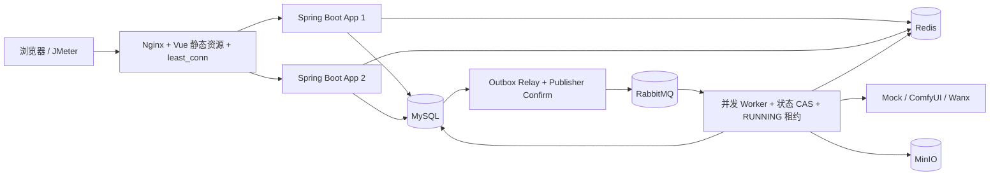

# 当前架构链路

## 提交控制面

1. Spring Security 校验 JWT，得到 `userId`。
2. 校验 `Idempotency-Key` 和请求哈希；已成功提交的相同请求直接返回原任务。
3. Redis Lua 原子检查用户级、全局每秒限额。
4. MySQL 事务内使用条件 UPDATE 扣减余额，同时创建 PENDING 任务和 Outbox 事件。
5. Outbox Relay 以数据库租约抢占事件，发送持久化消息并等待 RabbitMQ Publisher Confirm；失败按指数退避重试。
6. 立即返回 `taskUuid`，客户端不等待图片生成。

## 异步执行面

1. Worker 通过状态 CAS 将 PENDING/RETRYING 抢占为 RUNNING，同时写入 Worker 标识和执行租约；抢占失败直接 ACK。
2. Provider 生成图片，MinIO 保存结果。
3. Worker 周期续租；成功更新要求任务仍由当前 Worker 持有且租约有效，因此取消或恢复操作不会被迟到结果覆盖。
4. 临时失败进入 TTL 重试队列，超过上限落 FAILED 并进入 DLQ。
5. 定时恢复过期的 RUNNING 租约，经状态 CAS 转为 RETRYING 并写入新 Outbox；达到上限则转 FAILED。
6. 查询优先读 Redis，未命中回源 MySQL，缓存 TTL 为 10–15 分钟随机值。

## 一致性边界

余额扣减、任务创建与 Outbox 写入处于同一 MySQL 本地事务。事务提交后由 Relay 异步投递并等待 Publisher Confirm；投递失败不会丢失任务，而是保留 Outbox 并退避重试。Publisher Confirm 成功但 SENT 状态落库前宕机时可能重复投递，消费者依靠任务状态 CAS 保证业务幂等。
