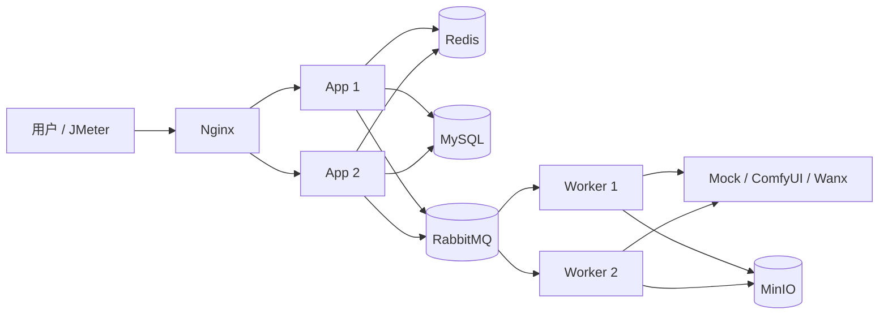

# AIGC-GameFlow 高并发核心版 PRD

> 实施状态：核心范围已于 2026-08-05 完成；验证结果见 [IMPLEMENTATION_RESULT.md](IMPLEMENTATION_RESULT.md)。

> 版本：V2.0
> 定位：面向游戏活动的异步 AI 图片任务平台
> 目标：用最小范围完成一个可运行、可压测、可解释的 Java 实习项目

## 1. 产品场景

游戏上线或周年活动期间，玩家上传头像并选择模板，系统异步生成个性化角色海报。活动高峰会同时出现大量任务提交和状态查询，而真正的图片生成受 GPU 或第三方 API 并发限制。

系统需要做到：

- 提交接口快速返回任务 UUID，不等待图片生成。
- 重复点击或客户端重试不会重复创建任务、重复扣费。
- Redis 对用户和接口实施分布式限流。
- RabbitMQ 削平入口流量，Worker 按下游容量受控消费。
- 重复消息不会导致任务重复执行。
- 临时失败可以重试，超过上限进入死信队列。
- 任务状态优先从 Redis 查询，降低高频轮询对 MySQL 的压力。
- Nginx 将请求负载均衡到至少两个无状态应用实例。

## 2. 项目边界

### 2.1 首期必须实现

1. 用户注册、登录与 JWT 鉴权。
2. 单任务提交、查询、取消和人工重试。
3. `Idempotency-Key` 幂等提交。
4. MySQL 原子余额扣减。
5. Redis Lua 用户级和接口级限流。
6. Redis 任务状态缓存。
7. RabbitMQ 主队列、延迟重试队列和死信队列。
8. 消费者状态 CAS 和手动 ACK。
9. ComfyUI、阿里云百炼万相、Mock 三个 Provider。
10. MinIO 统一存储图片。
11. Nginx 负载均衡两个应用实例。
12. JMeter 压测脚本和真实压测报告。

### 2.2 明确不做

- Agent、Tool Calling、聊天页面和 Neo4j 知识图谱。
- Spring Cloud、Nacos、Seata、Kafka、Elasticsearch和 Kubernetes。
- 分库分表、复杂微服务拆分和动态线程池管理平台。
- 首期 Transactional Outbox；先使用 RabbitMQ Publisher Confirm，并在文档中明确双写边界。
- 用真实万相或 ComfyUI 证明 API 高吞吐；控制面压测统一使用 Mock Provider。

## 3. 核心链路



请求链路：

```text
JWT鉴权
-> Redis Lua限流
-> 校验Idempotency-Key
-> MySQL原子扣减余额
-> 创建PENDING任务
-> 投递RabbitMQ
-> 返回taskUuid
-> Worker原子抢占任务
-> 调用Provider
-> 上传MinIO
-> 更新MySQL和Redis
```

## 4. 核心接口

### 4.1 提交任务

```http
POST /api/generation/jobs
Authorization: Bearer <token>
Idempotency-Key: <client-generated-key>
Content-Type: application/json
```

```json
{
  "prompt": "anime game anniversary poster",
  "negativePrompt": "blurry, low quality",
  "preferredProvider": "MOCK",
  "size": "1024x1024"
}
```

成功返回 HTTP 200/201；同一幂等键和相同请求返回第一次创建的任务；同一幂等键对应不同请求返回 HTTP 409。

### 4.2 查询任务

```http
GET /api/generation/jobs/{taskUuid}
```

查询必须同时校验 `taskUuid + userId`。缓存 Key：

```text
task:{userId}:{taskUuid}
```

### 4.3 取消与重试

```http
POST /api/generation/jobs/{taskUuid}/cancel
POST /api/generation/jobs/{taskUuid}/retry
```

排队任务可取消；运行中任务采用协作式取消，不能取消下游时忽略迟到结果。

## 5. 并发正确性

### 5.1 幂等

`gen_task` 新增：

```text
idempotency_key
request_hash
version
retry_count
```

唯一索引：

```sql
UNIQUE KEY uk_user_idempotency (user_id, idempotency_key)
```

数据库唯一约束是最终防线，Redis只用于快速拦截。

### 5.2 原子扣减

```sql
UPDATE sys_user
SET balance = balance - 1
WHERE id = ? AND balance > 0;
```

影响行数为 0 时返回余额不足，禁止“先查余额再写回”。

### 5.3 消费幂等

Worker 执行前原子抢占：

```sql
UPDATE gen_task
SET status = 1, version = version + 1, update_time = NOW()
WHERE task_uuid = ? AND status IN (0, 5);
```

抢占失败直接 ACK。成功、失败和取消更新均携带预期状态，防止迟到结果覆盖最终状态。

## 6. Redis设计

只承担两项职责：

1. Lua 限流：用户级默认 5 次/秒，接口级默认 300 次/秒。
2. 任务详情缓存：TTL 10 分钟并增加随机抖动。

Redis不是余额和任务状态的最终事实源，最终数据以MySQL为准。

## 7. RabbitMQ设计

队列：

```text
generation.execute.q
generation.retry.q
generation.dlq
```

首期要求：

- durable 队列和持久化消息。
- Publisher Confirm。
- 手动 ACK。
- `concurrency=4`、`max-concurrency=16`、`prefetch=20` 作为初始值。
- 网络超时、429和部分5xx最多重试3次。
- 参数错误和鉴权错误直接进入失败状态。
- 超过重试次数后进入DLQ。

线程数是配置初值，不是性能结论，最终根据压测调整。

## 8. Nginx与部署

Docker Compose 至少启动：

```text
nginx
app-1
app-2
mysql
redis
rabbitmq
minio
mock-provider
```

Nginx 使用 `least_conn` 或轮询策略。应用实例无本地会话，JWT、Redis和MySQL保证请求可以落到任意实例。

验收时停止一个应用实例，另一个实例必须继续提供提交和查询服务。

## 9. Mock Provider

Mock Provider 用于稳定验证 Java 控制面：

- 延迟可配置为 500–2000ms。
- 失败率可配置。
- 支持模拟超时、429和500。
- 返回固定测试图片。

真实 Provider 只做功能联调，不作为高并发报告依据。

## 10. 验收标准

以下是目标，不得在未压测前写入简历作为完成数据：

| 场景 | 验收目标 |
| --- | --- |
| 提交接口 | 200–300 RPS持续60秒，P95小于200ms |
| 查询接口 | Redis命中时500–1000 RPS |
| 幂等风暴 | 100个并发相同Key只创建1个任务、只扣1次余额 |
| 重复消息 | 同一任务只允许一个Worker执行 |
| 节点故障 | 停止一个App后Nginx自动转发到另一个App |
| Worker故障 | 未ACK消息能够重新投递 |
| 慢Provider | Provider延迟不阻塞提交接口 |
| 最终失败 | 重试3次后进入DLQ并记录错误 |

必须提交：

- `performance/` 下的JMeter脚本。
- 测试环境、并发参数、RPS、P95/P99和错误率。
- 优化前后对比报告。
- 幂等、超扣和Worker宕机测试结果。

## 11. 实施顺序

### M1：清理与正确性

- 删除Agent、Neo4j和聊天前端。
- 实现幂等键、请求哈希、原子扣减和状态CAS。
- 为并发正确性补自动化测试。

### M2：Redis与RabbitMQ

- Redis Lua限流和任务缓存。
- 消费并发、Publisher Confirm、重试队列和DLQ。
- 新增Mock Provider。

### M3：Nginx与压测

- Compose启动两个应用实例和Nginx。
- 编写JMeter脚本。
- 完成故障演练和压测报告。

## 12. 面试口径

```text
高并发发生在任务提交和状态查询的控制面；图片生成属于受GPU和第三方配额限制的执行面。
系统通过Nginx扩展无状态API实例，通过Redis完成分布式限流和热点缓存，通过RabbitMQ削峰，
并使用MySQL唯一约束、原子扣减和任务状态CAS保证并发正确性。
```

面试时分别回答实际测得的 API RPS、查询QPS、Worker并行度、任务完成吞吐和队列积压量，不能用一个“并发数”概括整个系统。
